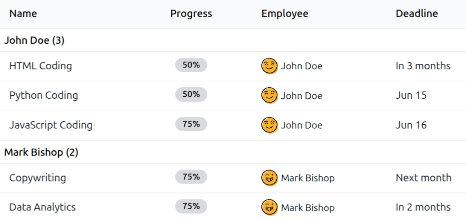
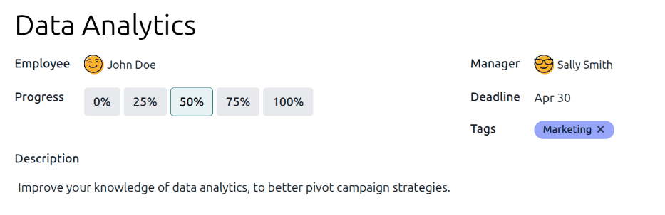
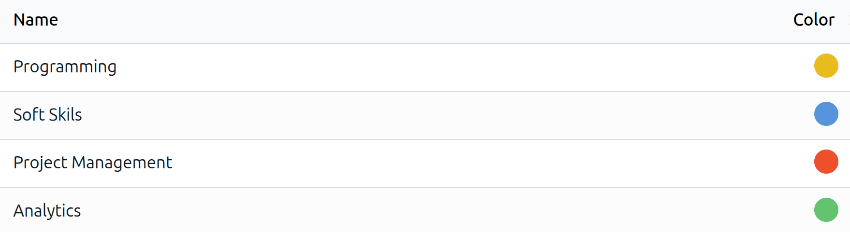
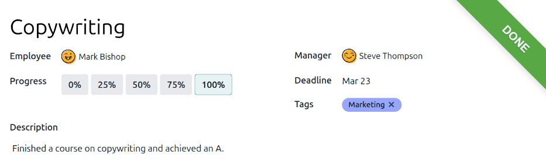

=====
Goals
=====

The Odoo **Appraisals** application allows managers to set and track clear goals for their
employees. Continuous progress towards goals give employees a concrete target between reviews, and
give managers reliable insights when evaluating performance.

View goals
==========

To view all goals, navigate to :menuselection:`Appraisals app --> Goals`. This presents all the
goals for every employee, in a default list view, grouped by :guilabel:`Employee`.

Click on an employee to expand the listed goals. Each goal displays the following information:

- :guilabel:`Name`: The name of the goal.
- :guilabel:`Progress`: The percentage of progress the employee has achieved.
- :guilabel:`Employee`: The employee assigned to the goal.
- :guilabel:`Deadline`: The date the goal should be achieved.

.. note::
   Only employees with goals assigned to them appear in the list.

.. _appraisals/goal-card:

Create goals
============

To create new goals, navigate to :menuselection:`Appraisals app --> Goals`, and click
:guilabel:`New` in the top-left corner to open a blank *Goals* form. Add the following information
on the form:

- :guilabel:`Goal`: Type in a brief name for the goal in this field.
- :guilabel:`Employee`: Select the employee being assigned the goal using the drop-down menu. Once
  this field is populated, the employee's manager populates the :guilabel:`Manager` field.
- :guilabel:`Progress`: Click the current percentage of competency for the goal. The options are
  :guilabel:`0%`, :guilabel:`25%`, :guilabel:`50%`, :guilabel:`75%`, or :guilabel:`100%`.
- :guilabel:`Manager`: Select the employee's manager using the drop-down menu, if not already
  selected.
- :guilabel:`Deadline`: enter the due date for the goal using the calendar selector.
- :guilabel:`Tags`: Add any relevant :ref:`tags <appraisals/add-tags>` to the goal using the
  drop-down menu.
- :guilabel:`Description`: Enter any details regarding the goal in this tab.

.. tip::
   Some goals can be broken down into steps, which may be input as a checklist. A checklist is a
   tool the employee may use to mark their progress.

.. _appraisals/add-tags:

Tags
----

Adding tags to goals can help when viewing the goals report, to see how many goals with specific
tags are assigned to employees.

To view all the current tags, and add new ones, navigate to :menuselection:`Appraisals app -->
Configuration --> Tags`. All tags appear in a list view. No tags come preconfigured, so all tags
must be added to the database.

To add a new tag, click the :guilabel:`New` button in the upper-left corner, and a new line appears
at the bottom of the list. Enter the tag name, then press return or click away from the field.
Click on a colored dot at the end of the line to select a color for the tag.

Goals library
=============

Update goals
============

Typically, goals are updated during an employee appraisal, directly on the appraisal form. However,
in some cases, it is necessary to update goal progress outside of an appraisal. This could be from
an employee completing a course or certification, documenting their goal progress or completion.

To update a goal's progress percentage outside of an appraisal, navigate to
:menuselection:`Appraisals app --> Goals`. Expand the employee whose goals are being updated, and
click on an individual goal to open the goal record.

Click the new :guilabel:`Progress` box to set the new progress level. It is recommended to add notes
in the :guilabel:`Description` tab, as the employee progresses with the goal. The notes should
include dates the progress changed, and any supporting information regarding the change.

Complete goals
==============

When a goal has been met, it is important to update the record. Navigate to
:menuselection:`Appraisals app --> Goals`. Expand the employee whose goals are being evaluated, and
click on an individual goal to open the goal record.

Click the :guilabel:`Mark as Done` button in the upper-left corner. A green :guilabel:`Done` banner
appears in the top-right corner of the goal card, and the :guilabel:`Progress` changes to
:guilabel:`100%`.

.. note::
   On the :guilabel:`Goals` dashboard, completed goals are indicated with a green :guilabel:`100%`
   tag in the :guilabel:`Progress` column.

